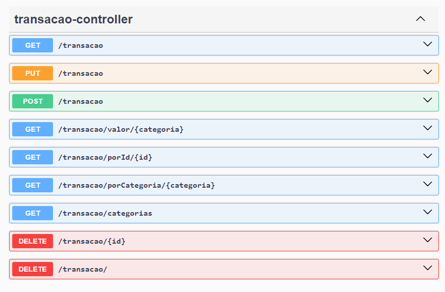

# Backend - Transações

O backend do projeto é responsável por fornecer uma API RESTful para o gerenciamento das transações.

## Estrutura do Projeto

O projeto é dividido em quatro partes principais:

- **Entidade Transação**: Classe Java que define o modelo de uma transação.
- **Repositório Transação**: Interface Spring Data JPA que define operações de banco de dados para a entidade Transação.
- **Serviço Transação**: Classe Java que contém a lógica de negócios para operações relacionadas às transações.
- **Controlador Transação**: Controlador Spring que define os endpoints da API RESTful para manipulação de transações.

## Tecnologias Utilizadas

- Java
- Spring Boot
- Spring Data JPA
- Spring Web (para criação de endpoints RESTful)
- Swagger (para documentação da API)

## Configuração e Execução

1. Certifique-se de ter o Java e o Maven instalados em sua máquina.
2. Clone este repositório.
3. Importe o projeto backend em sua IDE.
4. Execute o comando `mvn spring-boot:run` para iniciar o servidor backend. Por padrão, a aplicação estará disponível em `http://localhost:8080`.

## Endpoints

A API fornece os seguintes endpoints para manipulação das transações:

- `GET /transacao`: Retorna todas as transações.
- `GET /transacao/porId/{id}`: Retorna uma transação pelo seu ID.
- `GET /transacao/porCategoria/{categoria}`: Retorna todas as transações de uma categoria específica.
- `GET /transacao/categorias`: Retorna todas as categorias de transações disponíveis.
- `GET /transacao/valor/{categoria}`: Retorna o valor total das transações de uma categoria específica.
- `POST /transacao`: Adiciona uma nova transação.
- `PUT /transacao`: Atualiza uma transação existente.
- `DELETE /transacao/{id}`: Exclui uma transação pelo seu ID.
- `DELETE /transacao/`: Exclui todas as transações.

Para obter mais detalhes sobre os parâmetros e respostas de cada endpoint, consulte a documentação da API disponível em `http://localhost:8080/swagger-ui.html`.

## Contribuição

Contribuições são bem-vindas! Sinta-se à vontade para enviar pull requests ou abrir issues para reportar bugs ou sugestões de melhorias.

