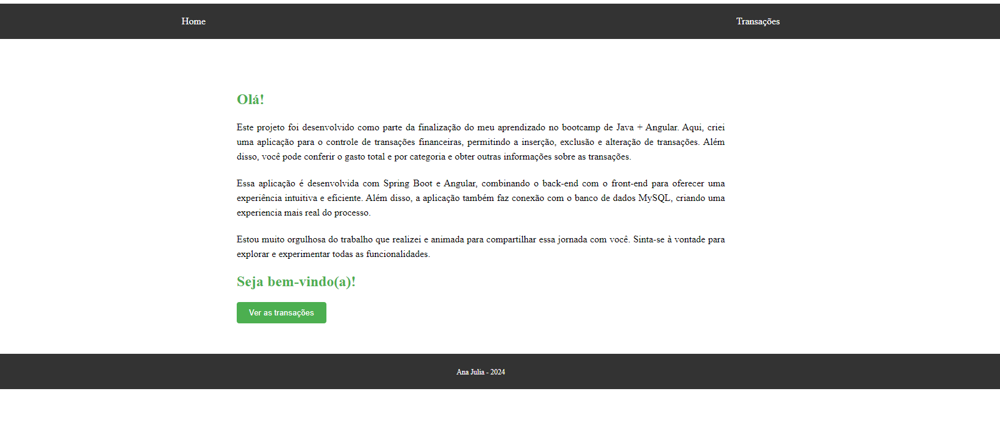
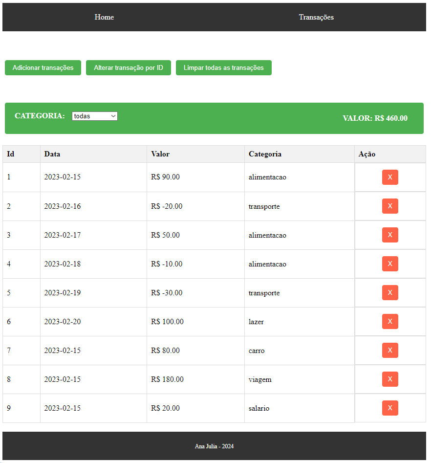
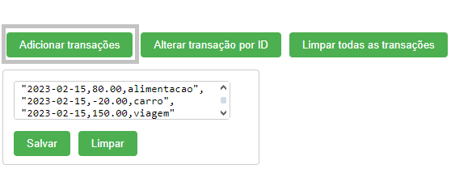

# Descrição do Projeto

Este projeto consiste na parte de frontend da aplicação de gerenciamento de transações, desenvolvida utilizando Angular. Ele faz uma conexão com uma API RESTful.

## Funcionalidades

- Listar todas as transações;
- Conferir o valor total;
- Filtrar transações por categoria com seu respectivo valor;
- Adicionar, alterar e excluir transações;
- Limpar todas as transações;

## Tecnologias Utilizadas

- Angular (front-end)
- TypeScript
- HTML
- CSS
- HttpClient para comunicação com o servidor

## Estrutura do Projeto

- **Transacao**: Classe TypeScript que define o modelo de uma transação.
- **TransacaoService**: Serviço Angular responsável por fazer requisições HTTP ao backend para operações relacionadas às transações.
- **Home Component**: Componente Angular para exibição da tela inicial, com breve descrição do projeto e indicação para a página de transações.
- **Transacao Component**: Componente Angular para exibição das transações, filtro por categoria e tabela de transações.

## Configuração e Execução

1. Certifique-se de ter o Angular CLI instalado globalmente em sua máquina.
2. Clone este repositório.
3. No diretório do projeto, execute `npm install` para instalar as dependências.
4. Execute `ng serve` para iniciar o servidor de desenvolvimento. Navegue para `http://localhost:4200/`.

## Uso

- **Listar todas as transações**: Acesse a página inicial da aplicação.
- **Filtrar transações por categoria**: Selecione uma categoria no seletor.
- **Adicionar transações**: Clique no botão "Adicionar transações" e insira uma ou mais transações separadas por vírgula no seguinte modelo: *"2023-02-15,-80.00,alimentacao"*.
- **Alterar transação por ID**: Clique no botão "Alterar transação por ID" e insira o ID da transação e a transação atualizada no mesmo modelo mostrado.
- **Limpar todas as transações**: Clique no botão "Limpar todas as transações", será necessário confirmar a ação, já que ela exclui todas as transações salvas no banco de dados.

## Contribuição

Contribuições são bem-vindas! Sinta-se à vontade para enviar pull requests ou abrir issues para reportar bugs ou sugestões de melhorias.
